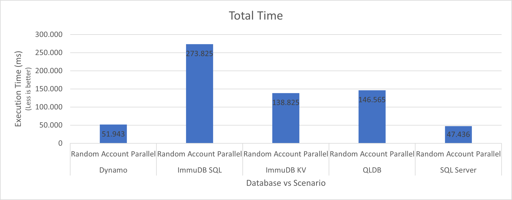
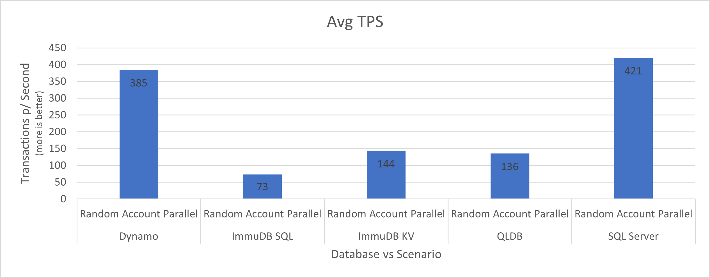
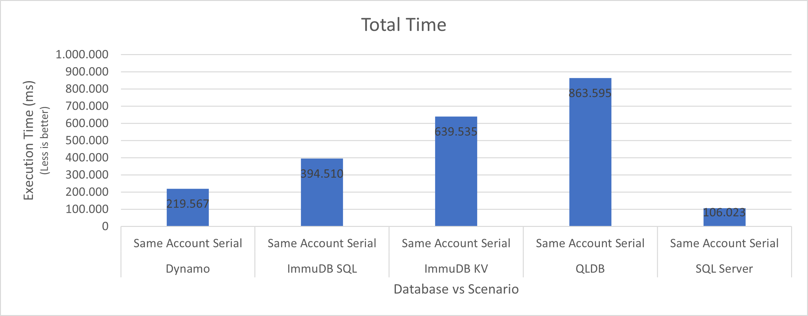
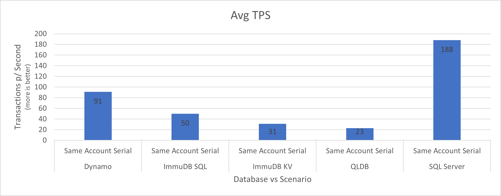
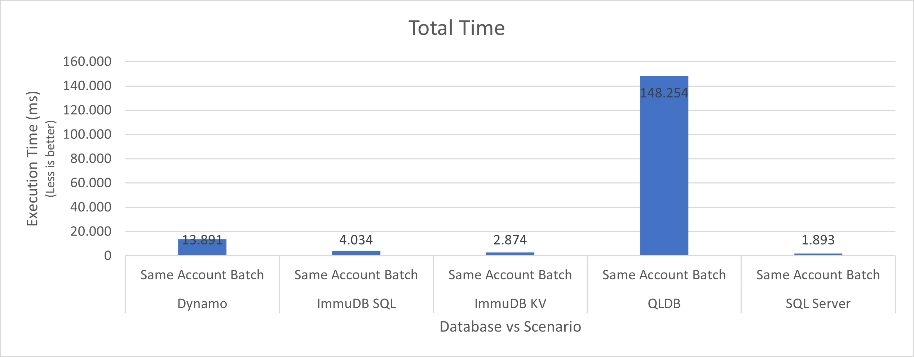
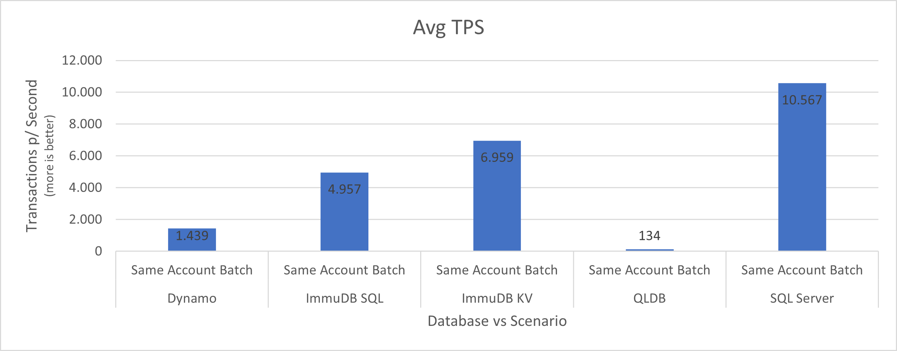

# Immutable Databases Benchmark

This experiment aims to compare the performance of a set of technologies that support immutability, traceability and verifiable data integrity.

Attention: DynamoDB is not an immutable database and was considered in the experiment only for comparison purposes.

### Whats is immutable data? 

Immutable data is a piece of information in a database that cannot be (or shouldn’t be) deleted or modified. Most traditional databases store data in a mutable format, meaning the database overwrites the older data when new data is available: https://www.tibco.com/reference-center/what-is-immutable-data

## Test scenarios

For this experiment, we did not consider concurrent requests from the same account. This scenario does not work well with any of the chosen technologies as it requires a transactional context generating locks.

In the real world, these entries would be processed from a stream technology, such as Kafka or Kinesis, distributing the accounts in specific partitions, guaranteeing processing sequencing.

This test consists of evaluating the behavior of the different technologies chosen in three scenarios of persistence of financial transactions and updating of the balance of a bank account:

- Random Account Parallel: this scenario consists of the persistence of a balance for different accounts executed by N threads in order to observe the behavior of technologies with parallelism.
- Same Account Serial: este cenário consiste na persistencia de diversos saldos para uma mesma conta.
- Same Account Batch: this scenario consists of persisting several balances for the same account performing the persistence in batches in order to verify possible performance gains.


## Technologies

For the experiment we selected 5 technologies:

- Amazon DynamoDB: It is not an immutable database nor does it have the necessary functionality. Considered in this experiment only as a comparative performance basis. https://aws.amazon.com/pm/dynamodb
- Amazon Quantum Ledger Database (QLDB): It is a fully managed ledger database that provides a transparent, immutable, and cryptographically verifiable transaction log. https://aws.amazon.com/qldb/
- ImmuDB: immudb is a database with built-in cryptographic proof and verification. It tracks changes in sensitive data and the integrity of the history will be protected by the clients, without the need to trust the database. It can operate both as a key-value store, and/or as relational database (SQL). https://immudb.io/
  - ImmuDB KV: Key/Value API - https://docs.immudb.io/master/develop/reading.html
  - ImmuDB SQL: SQL high level abstraction API - https://docs.immudb.io/master/develop/sql/transactions.html.
- Microsoft SQL Server 2022 Ledger Tables: Ledger tables are SQL tables backed up by external ledgers that ensure data integrity. Ledger tables come in two varieties: Append-only Ledger Table and Updatable Ledger Table. Append-only ledger tables only allow INSERT operations which help protect the data from later changes. https://learn.microsoft.com/en-us/sql/relational-databases/security/ledger/ledger-landing-sql-server?view=sql-server-ver16
## Experiment

For this experiment, we implemented a Spring Boot application with different Adapters for each technology and executed based on the profile determined at startup.

#### Notes: 

In this experiment, issues of idempotency were not considered.

Idempotency support:
- Amazon DynamoDB: Allow to implicitly insert or update data, balance update requires running in a transactional context.
- Amazon QLDB: Not supported and allows duplicate data. Requires a SELECT statement before an INSERT or UPDATE statement.
- ImmuDB: Guarantees idempotency by default.
- Microsoft SQL Server: It is possible to define keys in the tables with Unique Constraints guaranteeing the non-duplication of data, but the treatment of INSERT or UPDATE is done manually, intercepting exceptions or performing SELECT command first.


The number of test samples was initially set to 100,000. For some technologies, the execution time made it impossible to execute this quantity and they were reduced to 20,000 samples

### Infrastructure used

- Spring Boot application: released on an EC2 t2.micro with java-11-amazon-corretto.
- Amazon DynamoDB: it is a managed service. Tables were configured in the On-Demand capacity model.
- Amazon Quantum Ledger Database (QLDB): it is a managed service. Indexes were created for the Transactions and Balances tables:

```sql
CREATE INDEX ON balances (AccountId)
CREATE INDEX ON transactions (UniqueId)
```

- ImmuDB: Image 'codenotary/immudb:latest' was used in an ECS Fargate service with 2 vCPU and 4 GB RAM
- Microsoft SQL Server 2022 Ledger Tables: until the end of testing AWS still did not support SQL Server 2022 version on RDS. The tests were performed on an EC2 m5.large gp3 EBS with the AMI Ubuntu Server 20.04 LTS (HVM) with SQL Server 2022 Standard

No configurations or optimizations were made to the tested infrastructure and products.

In SQL Server you can achieve better results on faster SSD disks.

## Results

All execution logs can be seen [here](./benchmark/logs)

### Random Account Parallel





### Same Account Serial





### Same Account Batch






